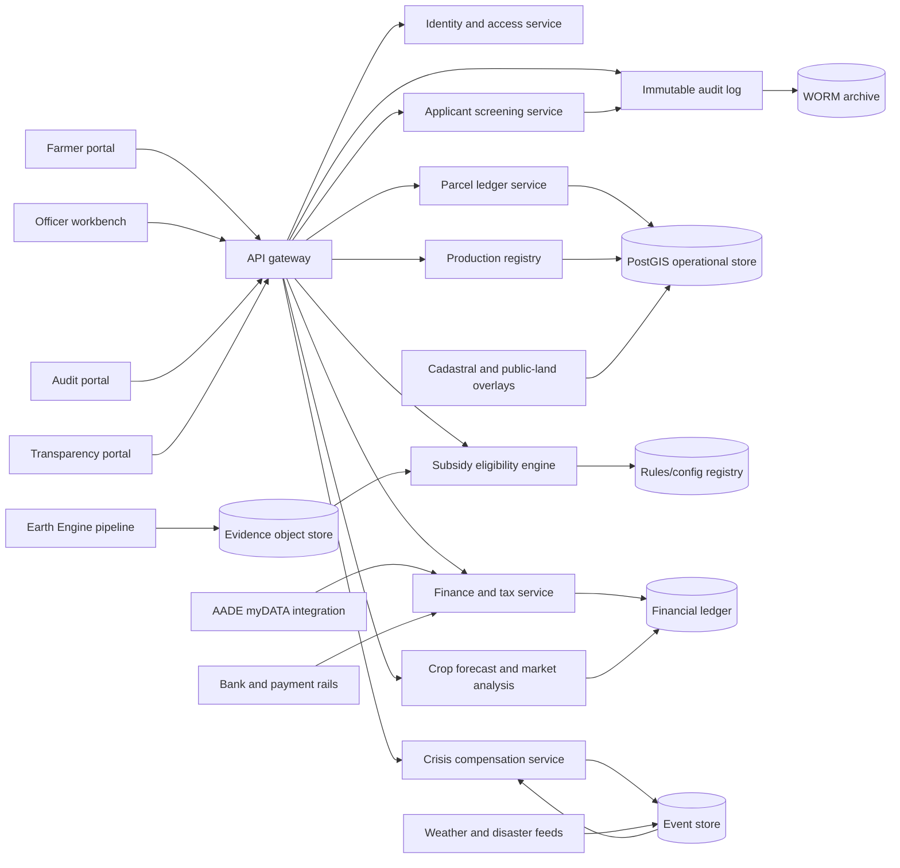

# System architecture

## 1. Logical architecture

## 2. Component responsibilities

### 2.1 Identity and access service

- Authenticates farmers, officers, surveyors, auditors, and public users.
- Presents a clear sign-in screen and a separate applicant registration screen.
- Redirects applicants back to sign-in after registration completion.
- Supports delegated access for accountants, cooperatives, agronomists, and family farm representatives.
- Enforces role-based and attribute-based authorization for tax, banking, parcel, and investigation data.

### 2.2 Applicant screening service

- Receives first name, surname, occupation, tax identifier, password metadata, and a yes/no public-office or conflict-exposure declaration from registration.
- Checks declared exposure and name/surname matches against authorized public-integrity or conflict-control datasets.
- Returns `enhanced_audit` / `close_audit` for flagged applicants.
- Returns `off_the_hook` / `standard_audit` for applicants with no declared exposure and no database match.
- Routes subsequent document uploads to standard audit or close audit.
- Does not collect, infer, store, or act on political-party preference.

### 2.3 Parcel ledger service

- Stores versioned parcel geometry in PostGIS.
- Calculates declared area, measured area, overlap area, eligible area, and excluded features.
- Links parcels to ownership, lease, cadastral, public-land, protected-area, and remote-sensing evidence.
- Prevents payment when unresolved overlaps, expired leases, or public-land conflicts exceed configured tolerances.

### 2.4 Production registry

- Registers crop seasons and production labels per parcel or sub-parcel.
- Records expected yield, declared yield, verified yield, harvest date, product type, and storage or sale destination.
- Maintains label history so a farmer cannot erase prior declarations after a satellite or tax mismatch.

### 2.5 Satellite and geospatial evidence pipeline

- Uses Google Earth Engine for imagery processing, vegetation indices, land-use classification, burn/flood/drought indicators, and historical time series.
- Uses Google Maps Platform for interactive parcel editing, map display, address search, and geocoding.
- Stores derived evidence snapshots, model versions, confidence scores, and reviewer annotations.
- Treats satellite outputs as control evidence rather than an unchallengeable final decision.

### 2.6 Subsidy eligibility engine

- Loads CAP and national support rules from a versioned configuration registry.
- Calculates line-item payments per farmer, year, parcel, scheme, production type, and eligible hectare.
- Explains every decision with input facts, rule version, rates, caps, reductions, holds, and reviewer overrides.
- Emits payment instructions only after required controls are complete.

### 2.7 Finance, tax, and debt service

- Imports or receives first-sale invoice events from AADE myDATA or an equivalent authorized integration.
- Reconciles product quantities and prices to crop-season records.
- Calculates taxable first-sale events and records subsequent product transfers separately.
- Applies debt offsets, recovery orders, restructuring plans, and payment holds according to configured legal rules.
- Supports stated-yield financial analysis with gross product value, market cap, product rates, by-product rates, by-product revenue, subsidy, costs, and net margin.

### 2.8 Crop forecast and market analysis service

- Exposes the stored yield database used by the browser crop forecast workflow.
- Combines crop yield benchmarks with weather forecast conditions, rainfall risk, soil suitability, operating cost assumptions, subsidy estimates, and market-rate assumptions.
- Produces graphs for forecast yield, maximum yield, income, subsidy comparison, market cap, product value, by-product rates, and by-product revenue.
- Keeps weather forecast information within the crop forecast service instead of presenting a standalone weather interface.

### 2.9 Crisis compensation service

- Ingests weather alerts, disaster declarations, satellite damage evidence, and field inspections.
- Geofences affected parcels and calculates loss percentages by parcel, production type, and year.
- Computes compensation using annual policy caps, insurance status, prior subsidies, prior compensation, and debt rules.
- Supports emergency advances, final settlement, appeals, and clawbacks.

### 2.10 Audit and transparency layer

- Records every material action in an append-only audit log.
- Preserves payment evidence in tamper-resistant storage.
- Publishes legally required beneficiary and payment information while protecting private tax, bank, and personal data.
- Shows applicant screening status, standard/close audit mode, and enhanced-audit review actions to authorized users.

## 3. Data integration map

| Integration | Purpose | Direction | Notes |
| --- | --- | --- | --- |
| National cadastral registry | Ownership, lease, public/private land, parcel references | Inbound | Must support legal evidence and conflict checks. |
| Google Earth Engine | Satellite imagery, vegetation indices, damage indicators, crop signals | Inbound processing | Requires model validation and human appeal path. |
| Google Maps Platform | Map display, parcel editing UX, geocoding | UI/service | API keys must be restricted and usage monitored. |
| AADE myDATA | First-sale invoices and tax reconciliation | Inbound/outbound | Tax rules must remain configurable by year. |
| Weather/disaster feeds | Drought, flood, frost, heat, fire, storm events | Inbound | Events are geofenced and linked to crop forecast and crisis workflows. |
| Public-integrity/conflict datasets | Applicant exposure and conflict screening | Inbound | Must be authorized, auditable, and limited to lawful integrity controls. |
| Bank/payment rails | Subsidy disbursement and debt offsets | Outbound/inbound | Bank accounts require verification and audit trail. |
| Livestock registry | Pasture and stocking-density checks | Inbound | Needed for pasture/livestock fraud controls. |
| Public transparency portal | Legal publication of beneficiaries and measures | Outbound | Applies privacy filtering and publication windows. |

## 4. API design

### 4.1 Example resources

- `GET /health` - check local API status.
- `GET /dashboard/data` - return initialized dashboard state.
- `POST /applicant-screening` - screen registration data for public-integrity/conflict exposure and return standard or enhanced audit status.
- `POST /documents` - upload document metadata and route analysis to standard audit or close audit.
- `POST /farmers` - create or update beneficiary identity.
- `POST /parcels` - register parcel geometry and rights evidence.
- `POST /crop-seasons` - declare annual production label.
- `POST /remote-sensing` - attach map, satellite, weather, or inspection evidence.
- `POST /first-sales` - record first-sale invoice linkage.
- `POST /debts` - record debt exposure.
- `POST /subsidy-claims/calculate` - calculate claim before submission.
- `POST /crisis-events` - create government-declared crisis event.
- `POST /compensation-claims/calculate` - calculate crisis compensation.
- `GET /annual-ledger` - retrieve annual farmer production, tax, debt, subsidy, and compensation summary.
- `GET /audit/events?entity_type=&entity_id=` - retrieve authorized audit history.

### 4.2 Decision explainability response

Each calculation or screening endpoint should return:

- Input facts used.
- Rule version and policy year where applicable.
- Eligible hectares and exclusions where applicable.
- Rate by scheme and production type where applicable.
- Deductions, penalties, caps, offsets, and holds.
- Applicant screening status and document audit mode where they affect routing or holds.
- Evidence references.
- Human reviewer and appeal status when applicable.

## 5. Security and governance

- Encrypt personal, tax, and banking data at rest and in transit.
- Keep geospatial evidence and payment decisions immutable after approval.
- Require four-eyes approval for privileged corrections, payment release from hold, and recovery cancellation.
- Log all administrative changes to rule configurations.
- Separate production operations from audit/investigation roles.
- Apply API-key restrictions for Google services and segregate service accounts by environment.
- Maintain data retention schedules for claims, payments, tax records, imagery evidence, and appeals.
- Limit applicant screening to public-integrity and conflict-control signals.
- Do not collect, infer, store, or act on political-party preference.

## 6. Deployment model

- Containerized microservices for API, rules engine, geospatial processing jobs, and portals.
- PostgreSQL/PostGIS for operational geospatial data.
- Object storage for satellite snapshots, documents, invoices, and inspection media.
- Event bus for tax imports, weather events, satellite jobs, payment status, applicant screening, and audit events.
- Separate analytics warehouse for risk dashboards and CAP performance indicators.

## 7. Non-functional requirements

| Requirement | Target |
| --- | --- |
| Availability | 99.9% for public and farmer portals during claim windows. |
| Auditability | 100% of payment lines must reference rule version and evidence set. |
| Geospatial accuracy | Parcel area calculations must use approved coordinate systems and tolerances. |
| Explainability | Any farmer-facing denial, enhanced-audit routing, or hold must provide a human-readable reason. |
| Scalability | Satellite jobs must process national parcel coverage by region and crop calendar. |
| Privacy | Tax, bank, and political preference data are never published in transparency outputs; political preference is not collected for screening. |
| Resilience | Crisis compensation workflows must operate during peak emergency demand. |
