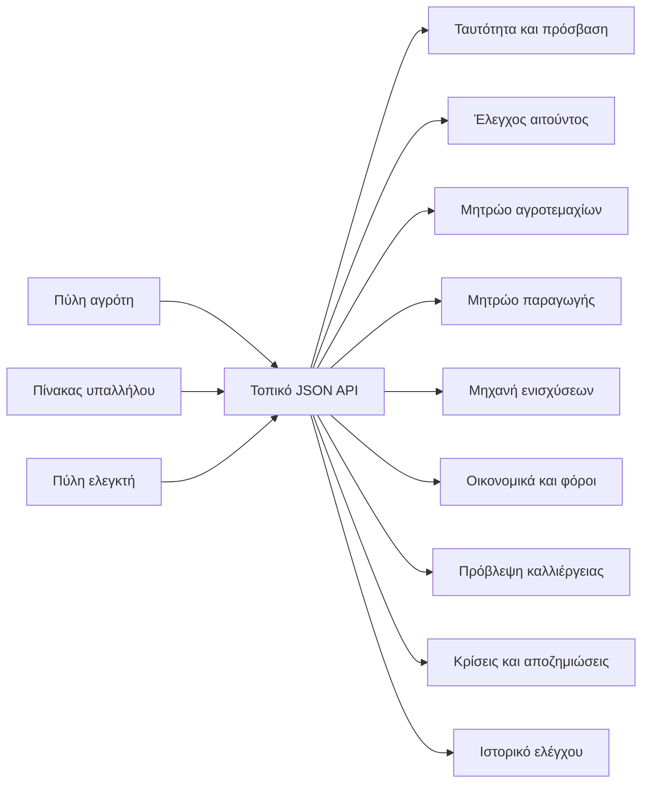

# Αρχιτεκτονική συστήματος

Το AgroLedger Greece είναι πρωτότυπο πρώτης έκδοσης για νέα ψηφιακή πλατφόρμα αγροτικών ενισχύσεων, ελέγχων, οικονομικής συμφωνίας και αποζημιώσεων κρίσεων. Η προεπιλεγμένη γλώσσα της εφαρμογής είναι τα ελληνικά, με διαθέσιμη εναλλακτική προβολή στα αγγλικά από τον επιλογέα `EL / EN` της διεπαφής.

## Λογική αρχιτεκτονική

## Κύρια υποσυστήματα

- **Ταυτότητα και πρόσβαση**: καθαρή οθόνη σύνδεσης, ξεχωριστή φόρμα εγγραφής, επιστροφή στη σύνδεση μετά την ολοκλήρωση εγγραφής.
- **Έλεγχος αιτούντος**: συλλογή ονόματος, επωνύμου, επαγγέλματος, ΑΦΜ και δήλωσης δημόσιου αξιώματος ή σύγκρουσης συμφερόντων με επιλογή ναι/όχι.
- **Δρομολόγηση ελέγχου**: καθαρός αιτών λαμβάνει `off_the_hook` και `standard_audit`; αιτών με έκθεση ή αντιστοίχιση βάσης λαμβάνει `enhanced_audit` και `close_audit`.
- **Μητρώο αγροτεμαχίων**: αποθήκευση γεωμετρίας, δικαιώματος, δηλωμένης και επιλέξιμης έκτασης.
- **Πρόβλεψη καλλιέργειας**: βάση αποδόσεων, καιρική πρόβλεψη εντός της ίδιας υπηρεσίας, κόστος, έσοδα, ενίσχυση και καθαρό περιθώριο.
- **Οικονομικά**: επιλογή δηλωμένης απόδοσης, μέγιστη αγοραία αξία, τιμή προϊόντος, τιμές υποπροϊόντων, έσοδα και γραφήματα.
- **Κρίσεις**: συμβάντα ξηρασίας, πλημμύρας, πυρκαγιάς ή άλλης ζημιάς με υπολογισμό ακαθάριστης αποζημίωσης.
- **Έλεγχος και διαφάνεια**: καταγραφή ενεργειών, κατάσταση δικαιολογητικών, ευρήματα και ελεγκτικές ενέργειες.

## Ασφάλεια και διακυβέρνηση

Το σύστημα δεν συλλέγει, δεν αποθηκεύει και δεν χρησιμοποιεί πολιτική ή κομματική προτίμηση. Ο έλεγχος εγγραφής περιορίζεται σε νόμιμα σήματα δημόσιας ακεραιότητας και σύγκρουσης συμφερόντων.

Τα API identifiers παραμένουν στα αγγλικά για σταθερότητα συμβολαίων, tests και μελλοντικών integrations. Η γλώσσα της διεπαφής ελέγχεται στο browser layer.

## Παραγωγική κατεύθυνση

Για παραγωγική έκδοση απαιτούνται πραγματική ταυτοποίηση, μόνιμοι λογαριασμοί, PostGIS, διασύνδεση με Κτηματολόγιο, AADE/myDATA, επίσημες καιρικές πηγές, payment rails, OpenAPI τεκμηρίωση και tamper-resistant audit storage.
